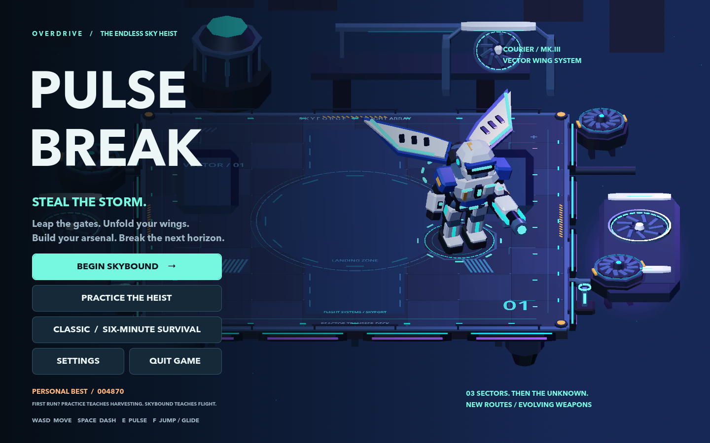
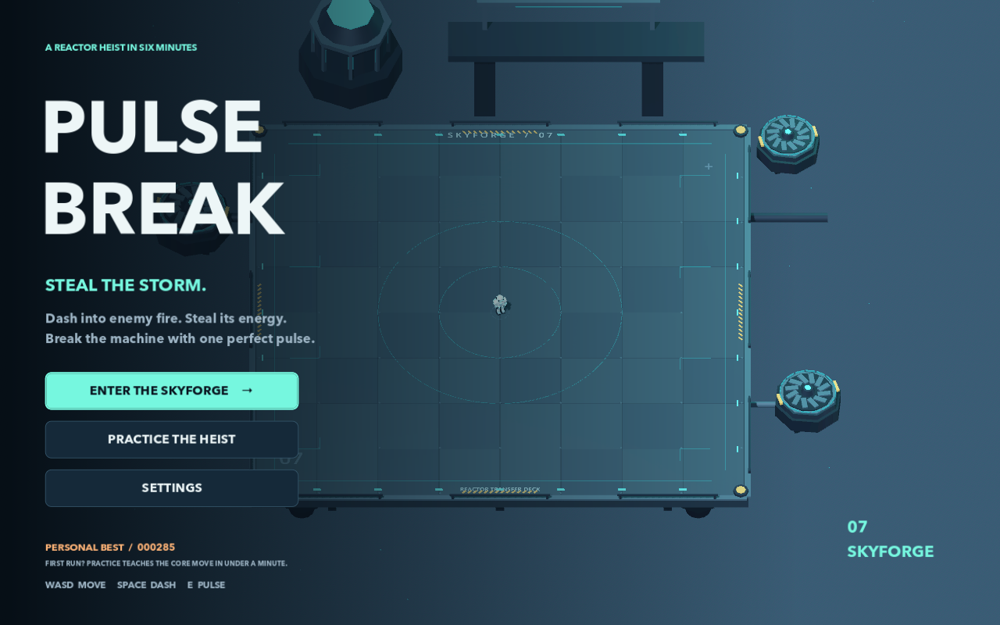
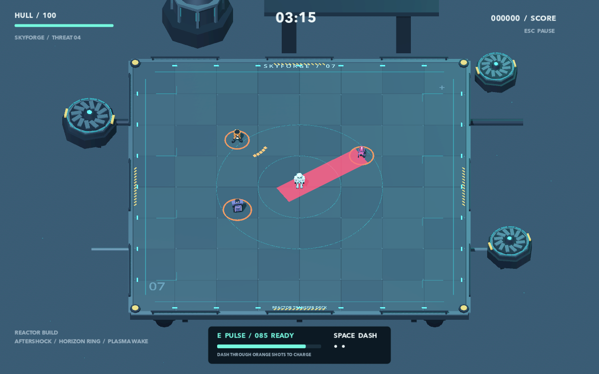

# Pulsebreak

**Steal the storm. Break the machine.** A native Mac arena roguelite with continuous generated sectors, evolving weapons and an original dubstep soundtrack.

**[Download Pulsebreak 1.2.0 for Mac](https://github.com/xindomusic/pulsebreak/releases/download/v1.2.0/Pulsebreak-1.2.0-macOS-universal.zip)** · **[Release notes](docs/RELEASE_1_2.md)** · **[Game review](qa/release-1.2-review.md)**

Unzip **Pulsebreak.app**, move it to Applications and choose **Begin Skybound**. The universal app includes Apple Silicon and Intel binaries and runs offline without Godot, an account or an API key. It is ad-hoc signed and has not been Apple-notarized; see [first-launch guidance](docs/GETTING_STARTED.md#play-the-download).



*Staged Metal capture of the visual style retained in 1.2. [Hear Prism Drive](docs/audio/prism/prism_drive.mp3) · [Music and combat preview](docs/audio/prism/battle_preview.mp3).*

## Release 1.2.0

Prism Drive adds a full 102-second half-time dubstep arrangement with growling bass and sharp synth stabs. Music volume responds to battle intensity and briefly drops around major blasts. The game includes four weapon families with five ranks, jump/glide traversal, moving gates, three environment styles, recurring Guardians, animated hit/destruction effects and Quit controls.

| Evidence | Result and scope |
|---|---|
| Regression checks | **591 checks in 14 suites**, all passed; includes 768 generated layouts |
| Audio generation tooling | Nine offline safety tests passed |
| Native audio | 36-second CoreAudio capture, no clipping, verified loop transport |
| Mac package | Universal app; signatures, ZIP and all 78 resource-pack members verified |
| Independent game grade | **8.4/10 as an indie arcade demo**, provisional; [weighted review and play/listening limits](qa/release-1.2-review.md) |
| Prior M4 performance | Release 1.1: 1280×800 Full Effects, median 16.654 ms / p95 18.459 ms; retained historical evidence |

The release is published from `main` under the annotated tag **v1.2.0**. The [GitHub release](https://github.com/xindomusic/pulsebreak/releases/tag/v1.2.0) includes the app ZIP, SHA-256 checksum file and notes. **v1.1.0** identifies the preceding verified release revision. Source archives contain prepared game assets; application bundles are distributed separately through GitHub Releases.

### A game-making experiment with GPT-6 Astra inside Codex

**Steal the storm. Break the machine.** Pulsebreak is a playable 3D arena roguelite for Apple Silicon Macs, built with Godot 4.7.2.

This repository documents an experiment by [xindomusic](https://github.com/xindomusic): take a game idea through research, design discussion, implementation, native packaging, and independent review using **GPT-6 Astra inside Codex**. The original prototype had three review/fix cycles; later updates added flight, endless sectors, weapons, richer effects and the selected ElevenLabs audio. Code, procedural art, audio, tests and review evidence are available for inspection and reproduction.



*Historical title render from the original packaged Mac app. The current visual style is shown at the top of this README; other illustrated scenes are explicitly staged source captures.*

**[Read the experiment](docs/EXPERIMENT.md)** · **[Play from source](docs/GETTING_STARTED.md)** · **[Browse the documentation](docs/README.md)** · **[Release review](qa/release-1.2-review.md)**

## Original experiment results — September 7

These results describe the original Classic prototype. Current release results are above; the historical 8.2 rating is separate from the current [1.2 review](qa/release-1.2-review.md).

| Question | Recorded result |
|---|---|
| Could the workflow produce a complete local game? | Native Mac app with waves, upgrades, a boss, practice, settings, saves, and original audiovisual assets |
| Did the final packaged game complete a run? | Yes, an automated normal-difficulty run won at 405.6 seconds |
| Did the engineering checks pass? | 131 checks: 25 combat, 68 save, 38 integration |
| Did three reviews establish a score above 9/10? | **No. The final observational score was 8.2/10** |
| What is still uncertain? | Extended human control feel, perceived audio quality, and alternate-build balance |

This is a documented project experiment, not a controlled model benchmark or a claim of commercial game quality. GPT-6 Astra was used during development; **the game does not call an AI model at runtime**. Playing or building it requires no OpenAI account or API key.

## The game

Choose **Begin Skybound** for continuous generated sectors across three environment styles. Clear machines, reach airborne relays, cross moving gates and install upgrades at checkpoints. Continue into the next sector or bank your score; Guardians recur as the run progresses. Four weapon families evolve through five ranks, with different projectiles, recoil and hit/destruction feedback.

**Classic** retains the six-minute survival run and final Reactor Guardian. Weapons fire automatically at nearby machines in both modes. The important decisions are movement, harvesting and when to release a pulse:

1. **Dash through orange shots** to absorb them and steal energy.
2. **Spend at least 30 energy on a pulse.** More stored energy means a larger, stronger blast.
3. **Choose upgrades** at Skybound checkpoints, or at minutes one through five in Classic.
4. **Read enemy warnings.** Charged lanes and ground hazards demand different evasive moves.

The Vector Carbine, Shatter Cannon, Arc Relay and Nova Lance offer different combat styles. Nine reactor upgrades, three regular enemy roles, repair cores and two-phase Guardians add progression and threats. **Practice the Heist** teaches the core dash-and-pulse move. See the [Overdrive guide](docs/OVERDRIVE.md) for continuous progression and weapon details.



*Staged scene used to inspect combat readability, not a recorded human playthrough.*

## Run it on a Mac

For the ready-to-play app, use the download above. Developers can run from source as follows; the editor, templates and generated app are excluded from Git.

1. Install the standard **Godot 4.7.2** editor from the [official release](https://github.com/godotengine/godot-builds/releases/tag/4.7.2-stable).
2. Clone this repository and import `project.godot` in Godot.
3. Press **F6** with `main.tscn` open, or **F5** to run the project.

```sh
git clone https://github.com/xindomusic/pulsebreak.git
cd pulsebreak
```

The [getting-started guide](docs/GETTING_STARTED.md) provides exact command-line setup and troubleshooting. The [Mac export guide](docs/MACOS_EXPORT.md) explains how to create a standalone `.app`. Existing local builds can be opened with `open build/Pulsebreak.app`.

| Control | Action |
|---|---|
| WASD / arrow keys | Move |
| Space | Dash in the current movement direction, or last direction while stationary |
| E | Release a pulse |
| F | Jump; hold to glide |
| Q | Switch unlocked weapons |
| 1 / 2 / 3 | Select an upgrade |
| Esc | Pause / resume / back; access Quit Game |
| F11 | Toggle fullscreen |

Gameplay uses a keyboard; menus also accept mouse clicks. Settings include remapping, Assist, Low Effects, volume, and screen shake. Changing to another app pauses live combat. See the [full player guide](docs/GAMEPLAY.md).

## Original review history

The user set the platform, requested research before implementation, approved the design, and asked for independent sub-agent ratings with a maximum of three improvement cycles. Codex coordinated implementation and tools; bounded sub-agent tasks covered art, audio, saves, and independent review.

| Review/fix cycle | Initial score | Post-fix observational score | Examples of improvements |
|---|---:|---:|---|
| [1](qa/review-round-1.md) | 7.15 | 7.385 | Practice completion, charger warning, remapped prompts, HUD geometry |
| [2](qa/review-round-2.md) | 7.73 | 8.05 | Immediate-direction dash, wall-stopped charges, a pulse lesson requiring a hit |
| [3](qa/review-round-3.md) | 8.15 | 8.2 | Slow effects on lunges, next-run Overdrive labeling, focus-loss pause |

The original above-9 target was not reached. Read the [experiment protocol](docs/EXPERIMENT.md), [lessons learned](docs/LESSONS_LEARNED.md), and [evidence index](qa/README.md) for the distinction between tests, bots, screenshots, native input checks, and human fun.

## Documentation

| Guide | What it covers |
|---|---|
| [Documentation index](docs/README.md) | Reading paths for players, developers, and experiment readers |
| [Release 1.2](docs/RELEASE_1_2.md) | Mac download, original soundtrack, verification, grade and known limits |
| [Experiment](docs/EXPERIMENT.md) | GPT-6 Astra inside Codex, user involvement, delegation, review cap, evidence limits |
| [Getting started](docs/GETTING_STARTED.md) | Fresh clone, editor setup, running, local saves, troubleshooting |
| [Gameplay](docs/GAMEPLAY.md) | Controls, combat rules, enemies, all nine upgrades, practice, difficulty |
| [Architecture](docs/ARCHITECTURE.md) | Scene ownership, state transitions, collision, persistence, extension points |
| [Testing and reproduction](docs/TESTING.md) | All suites, driver flags, visual captures, performance methodology |
| [Mac export](docs/MACOS_EXPORT.md) | Matching templates, local app creation, signing, distribution limits |
| [Assets](docs/ASSETS.md) | Procedural meshes, selected ElevenLabs audio, historical synthesis, UI and screenshot provenance |
| [Lessons learned](docs/LESSONS_LEARNED.md) | Concrete defects, fixes, and the limits of the measurements |
| [Roadmap](docs/ROADMAP.md) | Remaining work and evidence needed to call it an improvement |
| [Contributing](CONTRIBUTING.md) | Reporting bugs, proposing changes, validation expectations |
| [Changelog](CHANGELOG.md) | Current release and earlier feature/experiment changes |

## Project facts and provenance

The implementation is GDScript with Godot's Mobile renderer and Metal on the tested Mac. Start with [game.gd](scripts/game.gd), [rules.gd](scripts/rules.gd), and [the architecture guide](docs/ARCHITECTURE.md).

Native 1.2 audio and launch checks ran on **Mac mini M4 / 16 GB**. Full campaign and frame measurements come from release 1.1; the [current notes](docs/RELEASE_1_2.md) and [prior native run context](qa/release-native/run-context.json) distinguish those builds. Historical M1 Max measurements remain in the [QA index](qa/README.md). These are recorded results on specific hardware, not a performance guarantee for every Mac.

The original game code and assets were created for this experiment with Codex assistance. See [LICENSES.md](LICENSES.md) for provenance and Godot notices. Public source visibility does not by itself assign an open-source license to the original game content; no additional license grant has been selected.

Official product references: [GPT-6 Astra](https://developers.openai.com/api/docs/models/gpt-6-astra), [Codex documentation](https://developers.openai.com/codex/), and [Godot](https://godotengine.org/). This is xindomusic's experiment, not an official OpenAI or Godot project.
