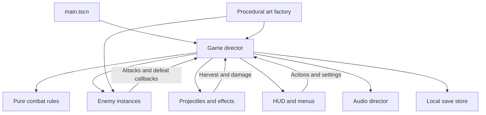

# Architecture

**Overdrive runtime update:** `weapons.gd` owns weapon progression and travelling projectiles; `combat_fx.gd` owns pooled contact/destruction animation; `level_generator.gd` produces seeded route data; `campaign.gd` loads successive routes. `game.gd` coordinates weapon → reactor upgrade → continued play and bank/quit states. See [Overdrive](OVERDRIVE.md) for the current flow. The earlier architecture below remains historical.

**Skybound follow-up:** [the new module map](SKYBOUND.md#implementation-map) describes traversal, campaign and sector art. The director now selects Skybound or Classic; airborne collision uses simultaneous swept XZ/Y overlap, and campaign gates share collision/visibility with machines and shots. `sector_complete` pauses at travel checkpoints before the next sector's upgrade choice. The remainder of this page describes the original flat-arena architecture retained by Classic.

Pulsebreak is a small Godot project with a deliberately explicit game director. Most runtime objects are constructed in GDScript. The editable scene is [main.tscn](../main.tscn), whose root `Node3D` attaches [game.gd](../scripts/game.gd).

## Ownership

| File | Responsibility | Main boundary |
|---|---|---|
| [game.gd](../scripts/game.gd) | Input, run state, timing, spawning, targeting, upgrades, tutorial, QA driver | Coordinates other modules |
| [rules.gd](../scripts/rules.gd) | Hull, charge, energy, cooldown, recovery, score, upgrade definitions | `RefCounted`; no scene or rendering dependency |
| [enemy.gd](../scripts/enemy.gd) | Role-specific movement, windups, attacks, shield and boss phase | `setup`, `update`, `take_hit`, director callbacks |
| [combat_field.gd](../scripts/combat_field.gd) | Pooled bullets, swept collision, hazards, fields, effects and delayed attacks | Uses director position/rules and emits consequences |
| [art.gd](../scripts/art.gd) | Arena and actor mesh construction | Static factories returning nodes |
| [hud.gd](../scripts/hud.gd) | Native Godot controls, labels, cards and modal screens | Emits an `action` signal; director owns gameplay |
| [audio_director.gd](../scripts/audio_director.gd) | Music stems and prioritized cue voices | `play_cue`, `set_intensity`, `set_volume`, `set_muted` |
| [save_store.gd](../scripts/save_store.gd) | Defaults, validation, atomic JSON replacement | Static `load_data`, `save_data`, `default_data` |

## Run states

The director stores a string state and updates combat only in `run` or `boss`. Practice is a flag and step counter within `run`, rather than a separate simulation system.

| State | Entry / exit behavior |
|---|---|
| `title` | Choose normal play, practice, or settings |
| `run` | Simulate waves or practice; normal minute checkpoints open upgrades |
| `upgrade` | Freeze combat while choosing one of three offers; install and resume |
| `boss` | Stop regular spawning; run the Guardian encounter |
| `paused` | Keep the prior gameplay state; resume, settings, restart, or title |
| `settings` / `rebind` | Edit preferences and bindings while retaining the return destination |
| `practice_complete` | Offer a fresh full run, another practice, or the title |
| `result` | Show score/build and restart choices after victory or death |

Esc and window focus loss can pause human gameplay. QA mode deliberately ignores focus loss so automation does not stall when another tool becomes active. Pausing gates the simulation; UI and audio have their own process callbacks.

Starting a run calls cleanup, resets rules and timing, clears upgrades and old hazards, returns the player to the starting position, and snapshots the Overdrive setting. Boss entry clears normal enemies and projectiles before applying transition recovery. A separate short defeat delay permits the boss finish effect before the victory screen.

## Movement and collision

The visual world is 3D, but combat is constrained to the arena's X/Z plane. The player uses direct movement with wall clamps. A dash samples the currently held movement vector when the action is accepted, falling back to previous facing only when stationary; waiting for the next physics tick caused an earlier directional bug.

Bullets use a pool and relative swept collision. For each tick, the field compares a segment from `(previous bullet − previous player)` to `(current bullet − current player)` against the origin. This captures a fast dash crossing a bullet even when neither endpoint overlaps it. Absorption reach differs from ordinary hit reach.

Chargers lock direction during windup. `distance_to_wall()` limits both the warning strip and actual lunge motion to the first wall intersection. Clamping axes independently after a diagonal lunge previously allowed an unmarked slide along the wall. Slow fields also affect lunge movement; the warning remains a conservative maximum path.

Ground hazards have warning and active stages. They use the rules' ground-hazard damage path so dash protection does not erase their tactical role. Recovery prevents repeated overlapping hits from applying all their damage in a single frame.

## Work bounds

| Collection | Limit |
|---|---:|
| Enemies | 27 |
| Active projectiles | 220 |
| Main expanding effects | 70, or 32 for the low-effects path |
| Ground hazards | 5 |
| Dash fields | 22 |
| Audio cue voices | 12 |

Additional spark/line guards and cue cooldowns avoid unbounded feedback. These are concrete implementation limits, not proof of worst-case performance on every machine. Inspect the [measured evidence](../qa/README.md) before changing a limit.

## Saves and settings

The store validates both loaded JSON and outgoing values. It accepts known properties, finite numeric ranges, and usable unique bindings; unknown properties are discarded. It writes beside the destination and renames the temporary file, preserving an existing save when writing fails.

UI rebinding updates InputMap and the shared key-label source. That shared formatter feeds the title, HUD, and current practice instructions. The saved state contains preferences and persistent milestones, not active enemies, wave time, or an interrupted run.

## Where to change things

| Change | Start here | Useful verification |
|---|---|---|
| Dash duration, recharge, energy caps | `rules.gd` | Combat tests plus a direct-control check |
| Upgrade numbers or text | `rules.gd`, relevant behavior in `game.gd`/`combat_field.gd` | Effect-specific check and offer-card inspection |
| New enemy pattern | `enemy.gd` and `art.gd`, spawning in `game.gd` | Telegraph/collision check and native scene inspection |
| Wave pacing or bonus cores | `game.gd` | Multiple seeds/build policies; avoid cherry-picking one win |
| A preference | `save_store.gd`, `hud.gd`, director application | Round-trip, invalid-data handling, live UI behavior |
| Appearance or sound | `art.gd`, `hud.gd`, audio files/director | Captures or listening, not only code assertions |

QA instrumentation currently lives alongside production logic in the director. That simplifies this experiment's reproducibility but is a reasonable extraction point if the project grows. Avoid introducing new architecture solely to make this small prototype resemble a larger engine framework.
