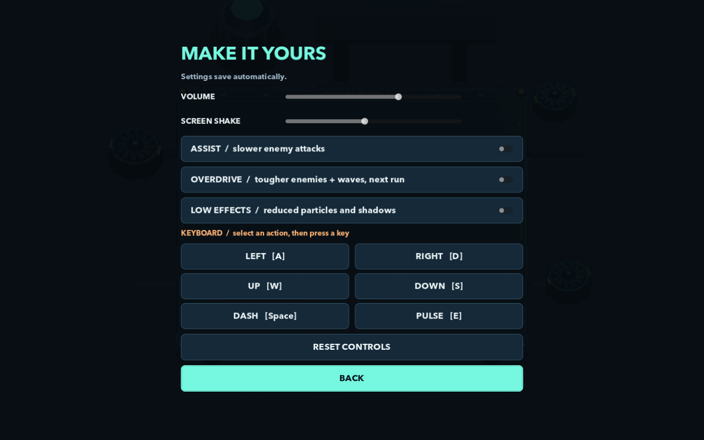

# Art, audio, and asset provenance

Pulsebreak's original visuals and audio were created for this experiment with Codex assistance. No external model pack, texture pack, sample library, or commercial soundtrack was imported. The assets are generated locally or represented directly in source.

## Geometry and environment

[art.gd](../scripts/art.gd) builds the Skyforge deck, perimeter machinery, player, three enemy silhouettes, and Guardian from Godot primitives and shared materials. Repeated details use shared resources and MultiMesh groups. Actor factories return nodes with named parts such as `Body`, `Reactor`, `Ring`, and `Shield`; gameplay can animate or toggle them without owning their mesh construction.

The visual palette separates the cyan player/pulse language, orange absorbable shots, and pink/red charge or ground warnings. The mostly open floor preserves movement space and visibility. This is procedural stylized 3D art, not a generated image projected into a scene.

Camera, lighting, sky, ambient light and fog are configured by the director in [game.gd](../scripts/game.gd). Runtime bullet, trail, ring, spark and hazard geometry lives in [combat_field.gd](../scripts/combat_field.gd). The app icon is [an SVG](../assets/icon.svg).

## HUD and typography

[hud.gd](../scripts/hud.gd) constructs the interface with Godot controls. It references macOS system fonts Avenir Next and Helvetica Neue by name; those font files are not bundled. Godot fallbacks remain available. Key labels come from the live binding map rather than hardcoded teaching text.



*Staged source capture. The publication images are copied without edits from the recorded renders.*

## Original audio

[generate_audio.py](../tools/generate_audio.py) uses Python's standard library for composition, synthesis and WAV writing. There are two synchronized music stems and thirteen gameplay cues:

| Group | Assets |
|---|---|
| Music | `music_foundry.wav`, `music_pressure.wav` |
| Abilities | `dash`, `absorb`, `pulse`, `ready` |
| Combat feedback | `shoot`, `hit`, `kill`, `warning` |
| Progress and results | `core`, `upgrade`, `boss`, `victory`, `defeat` |

The music uses 112 BPM, 16 bars, and an E-minor pitch family. The checked-in assets use 22,050 Hz signed 16-bit PCM. The fixed generation seed is 74921. WAV assets total roughly 3.5 MB.

To regenerate from the repository root:

```sh
python3 tools/generate_audio.py
```

This overwrites the generated WAV files and `qa/audio-report.md`. Preserve any manual review addenda before regenerating. Godot must reimport changed audio before a new export. Regeneration is optional for players because the assets are already checked in.

[audio_director.gd](../scripts/audio_director.gd) controls twelve cue voices, rate limits common sounds, reserves capacity for high-priority cues, and blends pressure music with progression. Dash readiness is connected to actual charge replenishment. Cue volume for a pulse varies with stored energy. The shutdown path stops streams and permits a short bounded mixer drain to address a reproduced resource-lifetime issue.

The [audio report](../qa/audio-report.md) records duration, level, size and shutdown checks. No audible mix audition was completed in the original experiment. No-clipping measurements and clean teardown cannot establish whether a soundtrack feels good.

## Published images

| Image | Origin |
|---|---|
| `docs/images/title.png` | Actual title render from the final packaged native app |
| `combat.png`, `boss.png` | Staged final-source encounters rendered with Godot/Metal |
| `upgrades.png`, `settings.png`, `practice-complete.png` | Staged final-source interface states |

Raw automatic-play captures stay in locally ignored QA capture directories. Selected publication images are committed so the README works on a fresh GitHub checkout. [Testing](TESTING.md) explains how to reproduce the capture types.

## Notices

[LICENSES.md](../LICENSES.md) records original-content provenance and the Godot engine's MIT notice. The engine license does not automatically assign a license to the original game code, music, or art. System fonts are referenced, not redistributed. Keep those distinctions when proposing or distributing derivatives.
