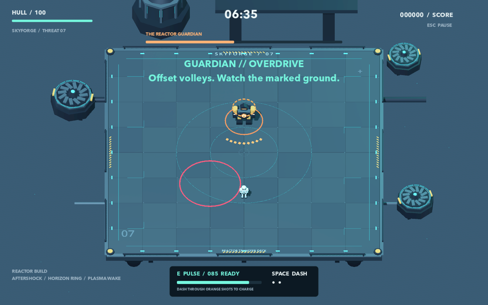
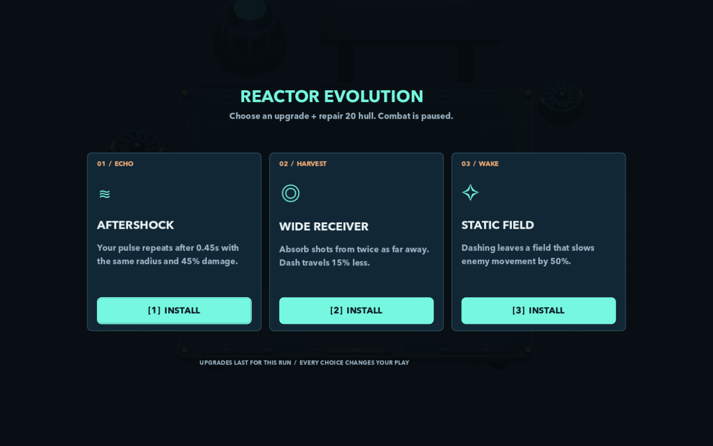
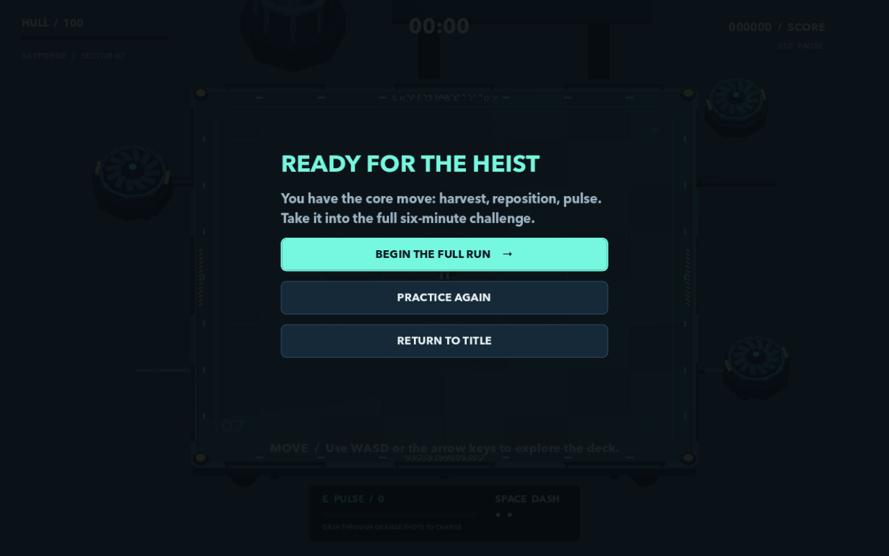

# Player guide

## Objective and controls

Survive six minutes of waves, then destroy the Reactor Guardian. Your automatic weapon handles nearby targets; the central skill is turning enemy projectiles into pulse energy.

| Input | Action |
|---|---|
| WASD or arrow keys | Move relative to the screen |
| Space | Dash in the currently held direction; use last facing when stationary |
| E | Spend stored energy on a pulse |
| 1 / 2 / 3 | Install the corresponding offered upgrade |
| Esc | Pause/resume, leave settings, or cancel a rebind |
| Tab / Shift+Tab | Move menu focus |
| Enter | Activate the focused menu control |
| Left / right | Adjust a focused slider |
| F11 | Toggle fullscreen |

Menus also accept clicks. Gameplay keys can be remapped in Settings, and teaching prompts update to reflect the bindings. Arrow movement remains available. Menu keys are reserved.

## Dash, harvest, pulse

You have two dash charges. They recharge sequentially at one charge every 1.5 seconds. A dash lasts about 0.18 seconds; charges do not allow overlapping dashes. Dashing protects against ordinary contact and projectile damage, but **active ground hazards can still hurt you**.

Dash through orange shots to consume them and collect energy. Normally, each absorbed shot supplies up to 10 energy, capped at 40 gained in one dash. Total energy is capped at 100. Ordinary kills also give 5 energy, providing a small fallback when there are few projectiles nearby.

A pulse needs at least 30 energy and spends the full stored amount. More energy increases its radius and damage. Spending now can clear an immediate threat; waiting can catch a larger group. The default pulse radius is `4 + 0.044 × energy`, and damage is `27 + 0.82 × energy` before upgrades.

Keep an escape route when harvesting. A dash that steals several shots can still leave you beside a charger or inside a future ground burst. After taking damage, a 0.75-second recovery period prevents many overlapping hits from consuming the whole hull at once.

## Enemy language

| Enemy | Behavior | Response to learn |
|---|---|---|
| Gunner | Maintains distance and fires orange fan volleys | Face the incoming shots and harvest through them |
| Charger | Locks a predicted direction during windup, then lunges along its marked lane | Leave the committed lane; the lunge stops at its first wall intersection |
| Bruiser | Uses frontal shielding, projectiles, and a marked ground attack | Pulse to break its shield; ordinary fire from behind avoids the front reduction |
| Reactor Guardian | Larger volleys and ground attacks; adds pressure below half hull | Alternate harvesting opportunities with escape from marked ground |

New machines have a brief arrival period before becoming vulnerable. The warning strip shows a charger's committed path. Pink/red ground rings warn about an area attack and remain a different hazard from absorbable orange bullets.

*Staged source capture used to inspect the boss's visual language.*

## Upgrades

Combat pauses for a choice of three at minutes one through five. Choose one, repair **20 hull** up to the 100 maximum, and resume. Selected upgrades are removed from the current run's offer pool.

| Upgrade | Family | Effect |
|---|---|---|
| Wide Receiver | Harvest | Nearly doubles absorption reach; dash travels 15% less far |
| Hot Capacitor | Harvest | 15 energy per stolen shot and up to 60 gained per dash |
| Life Circuit | Harvest | Absorbing a shot repairs 2 hull |
| Aftershock | Echo | Repeats the pulse after 0.45 seconds, at the same radius and 45% damage |
| Horizon Ring | Echo | Increases pulse radius by 35% |
| Chain Reaction | Echo | Arcs to up to four additional targets outside the direct hit set, at 70% damage |
| Plasma Wake | Wake | Leaves short-lived fields during a dash; nearby enemies take burn damage |
| Static Field | Wake | Dash fields slow enemy movement, including lunges, by 50% |
| Flare Drive | Wake | Dash contact deals 24 damage once per enemy per dash; pulses deal 20% more damage |

Aftershock uses the full original pulse power as its input and applies its 45% damage multiplier afterward. This matters because the base damage formula is not proportional to energy alone.

*Staged upgrade selection screen.*

## Repairs, boss transition, and scoring

An optional amber core first appears around 45 seconds, then roughly once per minute during waves. It remains for 12 seconds. Reaching it restores up to 22 hull, adds up to 20 energy, and awards 150 points. The route may cross enemy pressure; skipping it does not block progression.

At six minutes, normal enemies and old projectiles are cleared, the player is repositioned, up to 25 hull is restored, and energy is raised to at least 30. The Guardian then begins. Its second phase starts below half hull. A successful automated run lasted about 46 seconds beyond the wave phase; a human run can differ.

Score comes from kills, cores, and the boss reward. Harvesting itself is not a way to farm points indefinitely. Victory or death shows your score and installed build, with an immediate restart option.

## Practice and settings

Practice is outside the normal run timer. It teaches movement, one actual projectile absorption, one successful direct pulse hit, and a short charger encounter. A missed pulse leaves the lesson active with a retry hint. The completion screen offers a full run, another practice, or the title screen.

Assist slows enemy attack timing. Low Effects reduces visual-effect pressure and shadows. Volume and shake are adjustable. A win unlocks **Overdrive**, which increases enemy toughness and wave pressure; changing it applies to the next run. Progress and settings save locally. There is no mid-run save, multiplayer, or controller support in this experiment.

The alternate trail-focused driver did not win the recorded normal trial. Treat build advice here as a description of mechanics, not a promise that every combination has already been balanced through human play.
