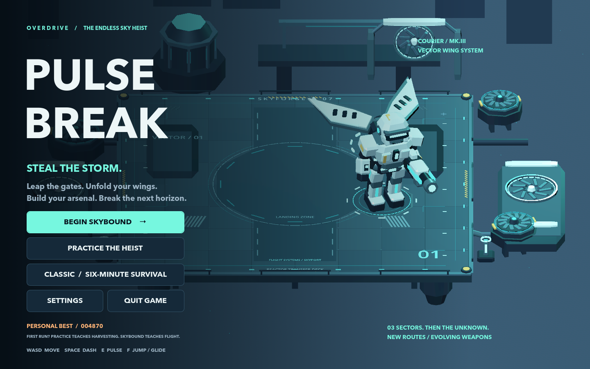
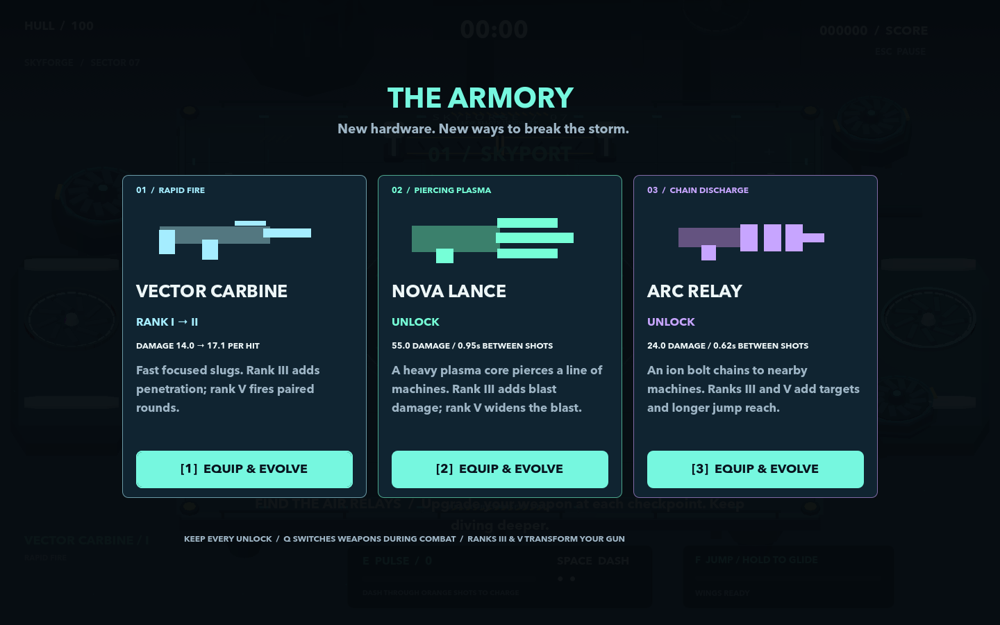
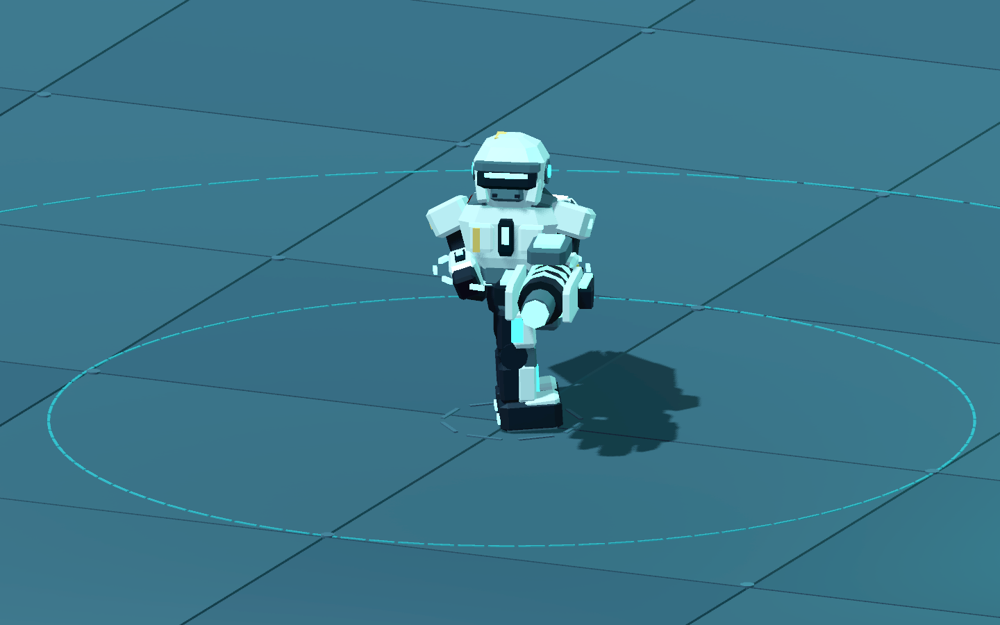
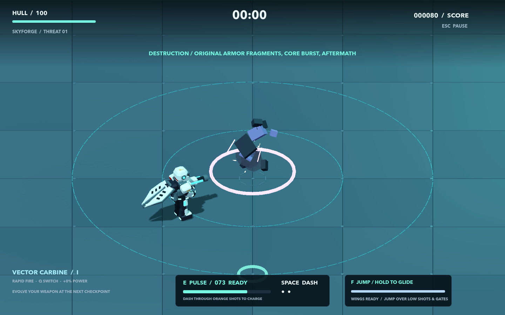
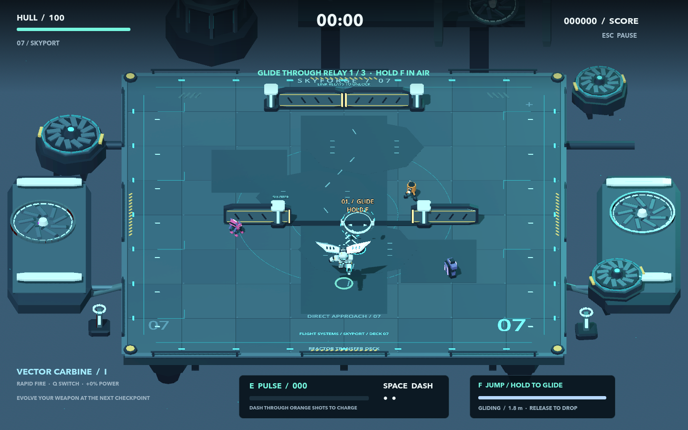
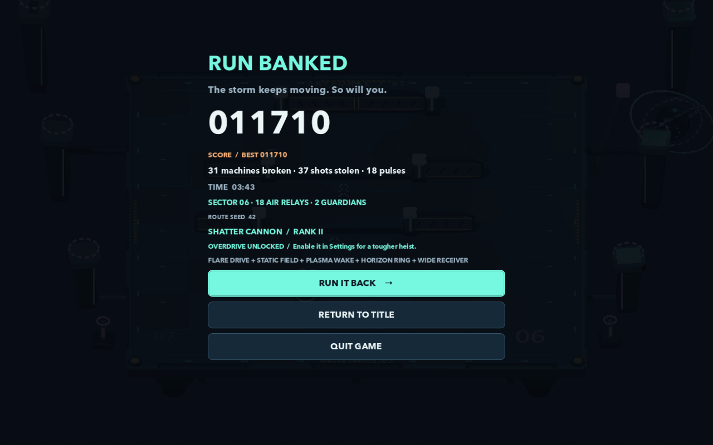

# Pulsebreak: Overdrive

This update follows the player's feedback on Skybound: visible Quit controls, a better courier and gun presentation, more satisfying firing/hits/destruction, meaningful weapon upgrades, and continuous generated levels.

Double-click **Play Pulsebreak.command** in this checkout and choose **Begin Skybound**. Use WASD or arrows to move, **Space** to dash, **E** to pulse, **F** to jump and hold to glide, **Q** to cycle unlocked weapons. Menus accept mouse and keyboard. **Esc → Quit Game** exits from play; Quit is also visible on the title, checkpoint, and results screens. Settings remap all eight actions and preserve older custom bindings.



## The arsenal

Shots now leave the courier's held weapon, travel through the world, and collide with machines and closed shutters. The courier turns the upper body to aim and recoils on firing. Each weapon has its own geometry, projectile, color, synthesized stereo cue, cadence, and target behavior.

| Weapon | Role | Rank III | Rank V |
|---|---|---|---|
| Vector Carbine | Rapid focused slugs | Penetrates two targets | Paired rounds |
| Shatter Cannon | Five-pellet spread | Seven pellets | Explosive pellet impacts |
| Arc Relay | Ion projectile with two chain jumps | Three jumps | Four jumps with more reach |
| Nova Lance | Slower heavy plasma, piercing three targets | Local blast damage | Wider blast, four-target penetration |

Upgrade cards show the immediate damage change or unlock cadence. Every rank adds 22% of base damage. Rank V also fires slightly faster. Unlocked weapons remain available throughout the run; Q changes equipment while preserving the reload, so switching cannot bypass a slow weapon's cadence. Ranks stop at V. Further mastery offers capped 2.5% overclocks, then hull service. The current weapon always appears among three offers.





Nonlethal hits have localized flashes, directional mechanical recoil and impact sparks. Kills release pieces of the actual enemy model, a core burst, sparks and brief smoke; fragments tumble, bounce and dissolve. The Guardian gets a larger breakup and a dedicated sound. Debris survives removal of the enemy node. Effects are pooled and capped at 160 active meshes, or 72 with Low Effects. Friendly projectiles are capped at 80; essential feedback has reserved effect and audio capacity.



Eight original stereo cues are generated by `tools/generate_weapon_audio.py`. The mix reserves voices for threats and important events, varies repeated firing pitch slightly, and briefly lowers music beneath major feedback. [The cue reel](../qa/overdrive-audio-preview.wav) and [numeric audio report](../qa/overdrive-audio.json) are available for audition. Numeric checks establish file properties and playback behavior; they do not establish perceived sound quality.

## Keep diving

The first three sectors teach flight, shutters, and Guardian combat. Every checkpoint offers **Upgrade & Dive Deeper** or **Bank Score & End Run**. A Guardian victory continues the same run instead of automatically ending it. Equipment, reactor upgrades, score, relays, and elapsed time carry forward.

Starting at sector four, a seeded route generator combines six route templates, mirrored and offset relay positions, one to three timed shutters, five encounter modifiers, three environment themes, and three or four aerial relays. Guardians recur every third sector. A new run from the title chooses a fresh seed; Restart repeats that run's layouts. The seed appears at checkpoints and on results.

Generated decks also receive route-specific floor inlays, muted navigation markings, and seeded variations in off-deck machinery. They retain the square arena footprint.



Generated routes preserve landing and recharge space, safe entry, reachable base-kit relays, usable shutter windows, and a clear center lane around shock pads. Enemy counts, spawn cadence, health scaling, hazard density and checkpoint history are bounded. Once all nine reactor upgrades are installed, that reward becomes hull/energy service, so later checkpoints remain usable. Levels continue until death, banking, or quitting; generated content reuses this game's three environment themes rather than promising unlimited new art.

## Verification and limits

[Research](OVERDRIVE_RESEARCH.md) informed weapon clarity, separate contact/destruction feedback, constrained generation, and pacing. The [independent review](../qa/overdrive-review.md) records defects found, corrections, evidence, and the final assessment. The previous [Skybound review](../qa/skybound-review.md) remains historical.

The corrected production simulation reached **12 sectors, four Guardians, and 38 relays** in 391.20 simulated seconds, with all nine reactor upgrades installed and later service checkpoints working. A second seed with different legal weapon choices banked six sectors in 223.82 simulated seconds. These are automated policy runs, not human play. A separate native Metal run completed the same alternate six-sector route in a fixed 1280×800 window. Its 15,008 render-frame samples measured 16.508 ms median, 18.143 ms p95 and 18.796 ms p99; the strict 16.7 ms p95 target remains unmet. Menus/transitions and the first three seconds are excluded; this measures presented frame intervals, not isolated GPU render time. Reports live under `qa/overdrive-final-normal` and `qa/overdrive-final-alternate`.



**491 checks pass across twelve suites**, including 768 generated layouts, projectile timing/cover/cadence, actual Quit exits, upgrades beyond reactor completion, audio routing, and keyboard controls. A separate native Metal input run passed 36 checks with 11 pose captures. The [validation inventory](../qa/overdrive-validation.json) records the method.

Run the regression suites with `sh tools/test.sh`. Reproduce staged native visual evidence with:

```sh
.tools/Godot.app/Contents/MacOS/Godot --windowed --resolution 1280x800 --path . --script tools/overdrive_visual_review.gd
```

Run a six-sector deterministic production simulation with:

```sh
.tools/Godot.app/Contents/MacOS/Godot --headless --fixed-fps 60 --path . -- --qa --qa-campaign --qa-sectors=6 --qa-dir=qa/overdrive-normal
```

Add `--qa-alt` for the second seed and different legal upgrade choices. `--qa-sectors` limits only the automation, allowing it to bank and stop; production play has no sector limit. Headless/fixed-step timing is not rendering performance. Images in this guide are explicitly staged native source renders, not a human playthrough. A score above nine or acceptance at a showcase requires evidence of player enjoyment and listening, in addition to implementation and automated checks.
