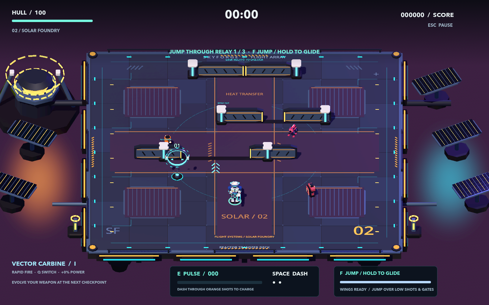
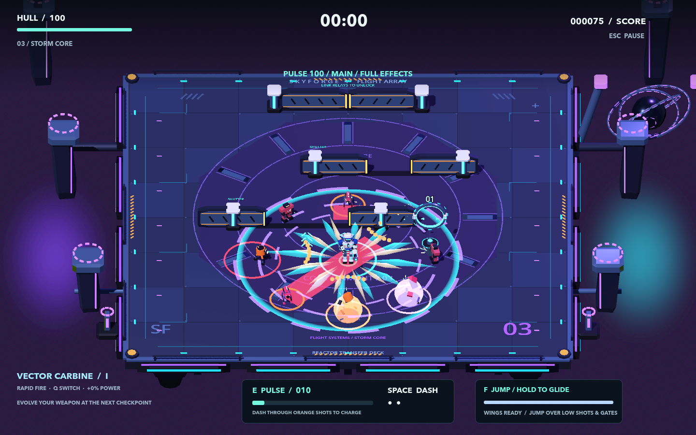

# Pulsebreak: Resonance

Resonance responds to the player's request for stronger colors, drum and bass, more engaging battle audio, and a cooler blast. It builds on [Overdrive](OVERDRIVE.md)'s flight, evolving weapons and endless generated sectors.

Double-click **Play Pulsebreak.command** and choose **Begin Skybound**. Move with WASD/arrows, dash with **Space**, release a pulse with **E**, jump/hold to glide with **F**, and switch unlocked weapons with **Q**. **Esc → Quit Game** exits. The launcher plays this checkout; older exported apps do not update themselves.


## Drum and bass

The original 174 BPM score has 64 bars, lasting 88.276 seconds. Syncopated kick patterns, sharp backbeats, ghost snares and rolling hats support centered sub bass, detuned upper bass, harmonic stabs and changing lead phrases. An introduction leads into a first drop, development, a half-time break/rebuild, a denser second drop, and a return into the loop. The track uses original synthesized instruments and notes; no downloaded songs or drum samples.

After hearing the first preview, the player requested **more aggressive bass and drums**. The revised score gives the Reese more driven upper harmonics, the snare more body, and the break an additional backbeat layer. Dry/processed drum blending increases weight while preserving transient shape and the kick's brief space in the bass. Foundation and drive sit higher in the adaptive mix; the lead sits slightly lower. This is a response to audition feedback, not a claim that the player accepted the revision.

- [Hear the full arrangement](audio/resonance-dnb.mp3), mixed at full-combat layer levels.
- [Hear an offline battle preview](audio/resonance-battle.mp3), with the four base weapon cadences and pulse/Guardian cues at representative runtime gains and event ducking. This reconstruction is not a gameplay recording.
- [Hear actual engine output](audio/resonance-engine.mp3): a 36-second native CoreAudio recording with four scripted weapon installations, full-charge pulses, and a staged Guardian encounter in the second half. It uses production combat/audio behavior, with the staging events listed in [recording metadata](../qa/resonance-engine-audio.json). The MP3 has a short ending fade; the [raw WAV](../qa/resonance-engine-audio.wav) preserves the capture. It is an audio demonstration, not a human playthrough or progression test.
- The [independent review](../qa/resonance-review.md) records source/engine checks and distinguishes listening from numerical inspection.

One `AudioStreamSynchronized` starts three equal-length stereo Vorbis stems: foundation, drive and lead. Nearby enemies, approaching shots, stored charge and Guardians raise the mix; release is slower than attack so passing threats do not make layers chatter. The kick/backbeat foundation stays present during quiet play. Menus and pause settle toward the calmer mix while the shared timeline continues. Music briefly ducks beneath major events, then recovers; ordinary auto-fire does not suppress it repeatedly. Twelve effect voices retain reserved capacity for danger cues, and the Master bus limits peaks at −1 dB.

The three music assets occupy approximately 7.1 MB. `tools/generate_resonance_audio.py` reproduces the PCM composition with NumPy and SoundFile, then exports MP3 previews with ffmpeg. Source synthesis uses seed 913174; encoded Ogg container serials may differ on regeneration. The [generator report](../qa/resonance-audio.json) gives sample counts, sections, peaks and hashes. Loop tails wrap on the shared sample timeline, with a 96-sample edge taper.

## Color and blast

Midnight navy decks, cyan/violet machinery, pearl/cobalt armor and warm coral/amber enemies give the game clearer color separation. The three environments use different lighting and saturated accents. Exterior power rails and soft light washes use shared resources outside the playable floor.



A pulse now has an immediate core/radius confirmation, brief inward filaments, tapered radial shards, a shock front reaching its full radius at about 220 ms, and a violet aftermath that clears within 820 ms. Its new stereo sound combines a crack, collapsing low body, metallic splinters and a dissipating tail. The strongest stored charge changes the HUD to **OVERLOAD** and produces an extra visual layer. Echoes retain their damage radius but use a weaker presentation.



Damage and input remain immediate. Rendered geometry stays inside the actual damage sphere, including airborne blasts; the floor boundary shows its intersection with the deck. A reused shadowless light briefly illuminates nearby surfaces. Low Effects disables that light and reduces decoration while retaining the core, shock front and boundary. Both effect animation and its light freeze with gameplay and clear on restart/title transitions.

No new pulse adds more than nine pooled meshes; Low Effects and echoes use six. The shared effect caps remain 160/72. Screenshots in this guide are staged native Metal captures with explicit fixed stepping, not recorded human play or graphics benchmarks.

## Verification

The [review](../qa/resonance-review.md), [runtime source manifest](../qa/resonance-source.json), [visual manifest](../qa/resonance-visual/visual-evidence.json) and [validation inventory](../qa/resonance-validation.json) identify methods and results. All fourteen regression suites pass **592 checks**, including 768 generated layouts, existing weapon/quit/flight checks, 53 pulse checks, and 48 new adaptive-audio checks. The reviewer caught a Classic-mode callback that initially overwrote threat-driven intensity with elapsed time; the real production callback now has regression coverage.

The final native run on **Mac mini M4 / 16 GB**, macOS 26.6.2, completed six sectors, two Guardians and 18 relays, banking at 223.82 game seconds with 76 hull. At an actual 1280×800 window with Full Effects, 15,856 active-gameplay frame intervals measured **16.332 ms median, 18.250 ms p95 and 18.979 ms p99**. Guardian segments measured 18.313 ms p95. The previous Overdrive p95 was 18.143 ms in the corresponding native run; this small difference is not evidence of a material performance regression. The [run context](../qa/resonance-native/run-context.json) records commands, image dimensions and source identity. Initial warm-up and noncombat menus/transitions are excluded; these intervals are not isolated GPU timings.

The full fourteen-suite run precedes the player's stronger-bass request. Both affected audio suites were rerun successfully after the final synthesis/mix revision; gameplay/visual source was unchanged. A separate native injected-keyboard run passed 36 checks with 11 captures. The final engine-audio demonstration contains 36.01 seconds of stereo CoreAudio output, no clipped samples and a peak of 0.437; scripted Guardian combat raises actual music intensity to 0.639. These are objective output checks, not a substitute for hearing the mix.

Run the suite with `sh tools/test.sh`. Reproduce the visual sequence with:

```sh
.tools/Godot.app/Contents/MacOS/Godot --windowed --resolution 1280x800 --path . --script tools/resonance_visual_review.gd
```

Reproduce a native six-sector automated route with:

```sh
.tools/Godot.app/Contents/MacOS/Godot --windowed --resolution 1280x800 --disable-vsync --path . -- --qa --qa-campaign --qa-alt --qa-sectors=6 --qa-dir=qa/resonance-native
```

Record the scripted engine-audio demonstration with:

```sh
.tools/Godot.app/Contents/MacOS/Godot --windowed --resolution 1280x800 --path . --script tools/resonance_audio_capture.gd
```

The Mac mini M4 is the target device. Frame intervals are evaluated in context; 16.7 ms p95 is an optimization goal, not an automatic score ceiling. Automated correctness, screenshots and audio measurements establish specific properties. An overall 9+ enjoyment rating still requires actual play and listening; the independent review leaves any unobserved categories explicit.

The [research notes](RESONANCE_RESEARCH.md) link primary sources for drum-and-bass structure, arrangement, music synchronization, event feedback and target-device measurement. Earlier reviews, music assets and evidence remain historical.
