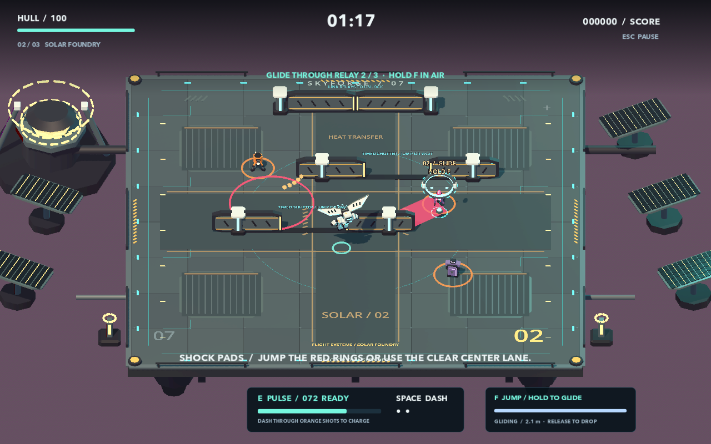

# Pulsebreak: Skybound

Skybound is the playable follow-up on `feat/skybound-showcase`. It expands the original flat arena game into a three-sector aerial heist while retaining **Classic / Six-minute Survival** and the original combat practice. The historical experiment and its 8.2/10 review remain unchanged.

## Play this checkout

Double-click `Play Pulsebreak.command`, or run:

```sh
./Play\ Pulsebreak.command
```

Godot 4.7.2 has been installed locally under `.tools/` in this workspace. A fresh clone still requires the [documented editor setup](GETTING_STARTED.md). The launcher runs the source project; it is not a signed standalone application.

Choose **Begin Skybound**. WASD/arrows move, **Space** dashes, **E** spends stolen energy, and **F** jumps. Keep F held through the apex to unfold the wings; release to descend quickly. Wing fuel recharges on the ground. Every action can be rebound in Settings; old profiles keep an existing F assignment and receive an unused jump key.

Your cyan ground marker shows where you will land. Jumping changes actual collision height: low shots, chargers, shutters, and shock pads pass underneath a sufficiently high courier. The Guardian's taller body remains dangerous. Air dashes cannot harvest shots below the courier. Land to refuel and steal volleys.

## The route

| Sector | Objective and distinctive challenge |
|---|---|
| **01 / Skyport** | Cross three numbered aerial relays and break four machines. Learn takeoff and clear one timed shutter. Enter the unlocked north gate. |
| **02 / Solar Foundry** | Cross three relays and break eight machines. Relay 02 requires deployed glide; its marker and near-miss message explain the hold action. Two offset shutters and alternating shock pads test route timing. |
| **03 / Storm Core** | Break the three aerial locks while navigating faster shutters and paired shock pads. The center lane stays clear. The locks summon the Guardian; the shutters retract for the duel. |

Each relay grants 18 charge, 8 hull, and 300 points. Between sectors, choose an upgrade and repair 20 hull. The final encounter restores up to 25 hull and ensures at least 40 charge. Runs are continuous; sector transition screens are not disk-save checkpoints.

All shutters block both sides' direct fire and movement. A pulse is a radial energy blast and can pass through cover. Gates use swept collision for dashes and shots. Shock pads warn for at least 1.35 seconds and share the same height-aware hazard rules as the boss.

## Model and animation

The courier is an original procedural model: beveled ceramic armor, dark mechanical joints, a visor, articulated hips/knees/shoulders/elbows, deployable swept wings, and thruster exhaust. Animation blends walking gait, jump posture, glide posture, dash lean, and impact-dependent landing compression. No downloaded models, Blender installation, or runtime service is required.

The three sectors have separate floor layouts, color/lighting treatments, animated machinery, and skyline props. The presentation uses a closer gameplay camera, a hero display on the title, persistent objectives, and a fuel/altitude HUD. Low Effects retains all gameplay telegraphs and traversal props.



*Staged source capture showing the required-glide marker, a shock-pad warning, and airborne courier. It is not a human playthrough.*

## Implementation map

| Module | Responsibility |
|---|---|
| `scripts/traversal.gd` | Buffered jump, vertical integration, hold-to-glide, finite fuel, landing events, simultaneous horizontal/vertical swept overlap |
| `scripts/campaign.gd` | Authored route data, airborne relay validation, cyclic shutters, hazards, sector goals and exits |
| `scripts/showcase_art.gd` | Sector scenery, gate and relay models, machinery animation, title pedestal |
| `scripts/art.gd` | Beveled mesh geometry and articulated courier animation |
| `scripts/game.gd` | Input, campaign/classic mode selection, stage transitions, cover-aware targeting, animation integration, QA policy |
| `scripts/combat_field.gd`, `scripts/enemy.gd` | Height-aware combat, gate occlusion, ground effects, gate-aware AI and warnings |
| `scripts/hud.gd`, `scripts/save_store.gd` | New objectives/flight readout, transition screens, remappable jump, legacy binding migration |

## Evidence and limitations

The [research brief](SKYBOUND_RESEARCH.md) connects specific design choices to primary sources. The [independent review](../qa/skybound-review.md) records ratings, defects found, corrections, and limits. [Native controls QA](../qa/skybound-controls.md) distinguishes injected keyboard events and rendered animation from human play.

The final independent assessment is **8.8/10 provisional for technical and visual quality**. Audio remains unscored, and human acceptance is unverified. The requested overall 9/10 and commercial showcase readiness are not established.

Final verification passes **261 checks**. Two simulated build policies complete all nine relays and win, and two native full runs also win. At a fixed 1280×800 window on this Apple M4/16 GB Mac, 8,664 real frame intervals yielded a 16.47 ms median, 17.842 ms p95, and 18.43 ms p99. The local p95 ≤16.7 ms target was not met. These are application frame intervals, not GPU execution or input-latency measurements; the earlier native run changed resolution mid-run. Full reports and retained losses are indexed in [QA](../qa/README.md).

Run all seven engineering suites with `./tools/test.sh`. For reproducible campaign simulation:

```sh
.tools/Godot.app/Contents/MacOS/Godot --headless --path . --fixed-fps 60 -- \
  --qa --qa-campaign --qa-dir="$PWD/qa/local-skybound"
```

Add `--qa-alt` for another seed/build policy. Remove `--headless` and `--fixed-fps` for real render timing. Headless timings are not FPS measurements. Staged screenshots use `tests/skybound_visuals.gd`; they are layout/pose evidence, not recorded human runs. Development losses remain in the `qa/skybound-*` reports.

The 9/10 objective is a quality target, not a guaranteed or purchased rating. This is a stylized arcade vertical slice. Extended new-player sessions, audio audition, controller support, broader hardware coverage, and additional encounter/content depth are still relevant before positioning it as a commercial showcase entry.
